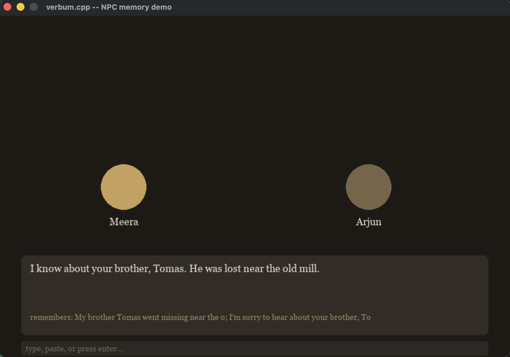

# verbum.cpp

  

An LLM inference engine written from scratch in C++ and CUDA. No PyTorch, no
llama.cpp, no third-party runtime doing the math — it loads published open
weights and runs the whole forward pass itself, checked line by line against
real HuggingFace output.

*Verbum* is Latin for "word", which is what the thing produces, one token at
a time.

This is the third in a set of from-scratch systems.
[RAAG](https://github.com/amankarki151/RAAG) parses a codebase in parallel
C++, builds a dependency graph of every file and function, and scopes
AI-assisted refactoring to exactly the blast radius a change can reach —
measured on a 579-file benchmark at 1290 files/sec (a 3.69x parallel
speedup from a `std::jthread` pool), with a CI gate that blocks a pull
request outright if it pushes a module's instability past threshold.
[Lattice](https://github.com/amankarki151/lattice) is a vector database
built from scratch — the same category of thing RAAG currently calls out to
Qdrant for. This is an LLM inference engine built from scratch — the same
category of thing RAAG currently calls out to Claude's API for.

None of the three call each other inside RAAG yet — that's the honest
state of it, not something to gloss over. What the demo below actually
proves is smaller and concrete: Lattice and verbum.cpp talking to each
other directly, for real. An NPC's memory, stored and retrieved by a real
HNSW index, generated by a real from-scratch inference engine. Wiring
RAAG's own retrieval and reasoning onto Lattice and verbum.cpp instead of
Qdrant and the Claude API is the obvious next step, not something already
done.

---

### The point, in one screenshot



[▶ Watch the demo](https://youtu.be/aP7grDJjJMA)

Two NPCs, Meera and Arjun, each with their own memory backed by a real
Lattice HNSW index. Tell Meera something, ask Arjun something unrelated, come
back to Meera — she remembers, he doesn't. Nothing about that sentence is a
mock-up; every piece of it is code in this repo.

---

## What it does

Loads a small open-weight model (Qwen3, ~0.6B) and runs it end to end:
safetensors parsing, BPE tokenizer, RMSNorm, RoPE, grouped-query attention,
SwiGLU feed-forward, KV-cache, INT8 quantization, sampling — on CPU or CUDA.

On top of the engine sits a small offline scene with NPCs you can talk to.
Their replies come from this engine. Their memory of what you said earlier
comes from Lattice, embedded directly as a library, not a network call.

Nothing here reaches the network at runtime. No API keys, no cloud inference.

Full architecture, every design decision, and the two real bugs that came out
of building the demo: [`ARCHITECTURE.md`](ARCHITECTURE.md).

## Quickstart

```bash
git clone https://github.com/amankarki151/verbum.cpp.git
cd verbum.cpp
cmake -B build -DCMAKE_BUILD_TYPE=Release
cmake --build build -j
```

Download Qwen3-0.6B's weights into `models/qwen3-0.6b/` (config.json,
tokenizer.json, model.safetensors — see `scripts/` for the download command),
then:

```bash
# plain f32, greedy
./build/generate -m models/qwen3-0.6b -p "The capital of France is" --greedy

# int8 weights, same prompt
./build/generate -m models/qwen3-0.6b -p "The capital of France is" --greedy --quantize

# GPU decode (needs a rebuild with -DVERBUM_ENABLE_CUDA=ON, and a CUDA device)
./build/generate -m models/qwen3-0.6b -p "The capital of France is" --greedy --cuda
```

The demo shell:

```bash
cd app
pip install pygame pyperclip pylattice-db
python3 demo.py
```

## Benchmarks

Real numbers, all three modes measured back to back in one sitting per
machine — not stitched together from different days, since this project
watched that give misleading comparisons more than once.

| Mode | Machine | tok/s | p50 latency | p99 latency | Weights |
|---|---|---|---|---|---|
| f32 | Mac (arm64) | 1.28 | 593.0 ms | 1857.9 ms | 3006.5 MB |
| int8 | Mac (arm64) | 1.72 | 547.8 ms | 1090.3 ms | 1686.7 MB |
| f32 | Kaggle (CPU) | 0.73 | 1372.2 ms | 1401.4 ms | 3006.5 MB |
| int8 | Kaggle (CPU) | 1.05 | 948.2 ms | 1036.0 ms | 1686.7 MB |
| cuda (f32) | Kaggle T4 | 28.01 | 35.6 ms | 37.8 ms | 3006.5 MB |

CUDA is ~25% of a T4's theoretical memory-bandwidth ceiling for this
workload — expected for a first integration with no kernel fusion yet, real
room to improve. Full notes on CPU variance and the quantization speed
discrepancy: [`bench/results.md`](bench/results.md).

<details>
<summary><strong>Component status</strong> (click to expand)</summary>

| Component | State |
|---|---|
| Safetensors loader | working |
| BPE tokenizer | working, matches HF reference on the test set |
| Forward pass (CPU) | working, logits match HF reference (max diff ~3e-5) |
| KV-cache + sampling | working, cached path matches full-sequence attention exactly (0.000000 diff) |
| CUDA kernels | working end to end — matmul, rmsnorm, rope, swiglu elementwise, residual add, attention-decode. Identical output to CPU confirmed on a T4 |
| INT8 quantization | working, identical output to f32; 3.99x smaller on quantized matrices |
| Python bindings | working, pybind11 wraps the engine text-in/text-out, verified against the C++ CLI exactly |
| NPC orchestration (Python) | working, prompt assembly and per-NPC memory isolation tested; real memory recall confirmed with an off-topic turn in between |
| NPC memory (Lattice) | working, real HNSW storage and retrieval confirmed correct against competing memories |
| Demo shell | working — pygame scene, click-to-talk, async generation and model loading keep the window responsive, clipboard paste, per-NPC memory visually confirmed |

</details>

<details>
<summary><strong>Known limitations</strong> (click to expand)</summary>

- Prefill is unbatched — one token at a time, not the batched path.
- Quantization and CUDA don't compose yet.
- `lm_head` loads as a redundant copy of `embed_tokens` despite the model
  tying them — ~622 MB wasted, not yet fixed.
- NPC memory embeddings come from the engine's own hidden states, not a
  purpose-trained embedding model — fine for a few memories, unverified at
  scale.
- NPC memory persists within one demo session, not across separate
  launches, by design — see `ARCHITECTURE.md` for why.

</details>

## Writing

- [What Actually Happens Inside a Transformer Forward Pass](https://amankarki.hashnode.dev/what-actually-happens-inside-a-transformer-forward-pass)
- [INT8 Quantization the Second Time Around](https://amankarki.hashnode.dev/int8-quantization-the-second-time-around)

## License

MIT
